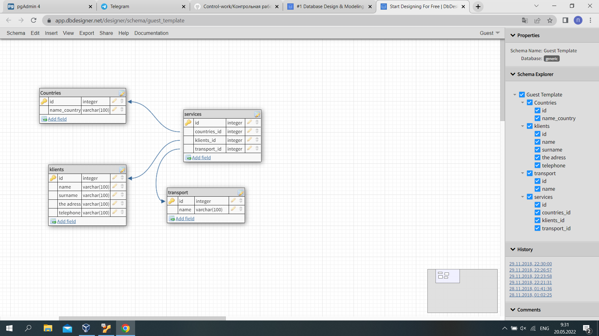

# Контрольная работа

---
## Лабораторная работа №1 
### Создание модели реляционной базы данных
**_Система банковских вкладов_**



---
## Лабораторная работа №2
### Создание сервера в postgresql
- Установил **Ubuntu** на **VirtualBox**
- В **Ubuntu** установил **postgresql**
- Создал в *postgresql* сервер **_'My_SQL_server'_**
- Далее для подключения к серверу с основной машины настроил **Firewall**

Добавления разрешения доступа для ip адресса
>sudo ufw allow from <ip_address>

Проверка состояния UFW
>sudo ufw status verbose

Подключился к виртуальной машине через ssh
> ssh ammin@192.168.1.1

Подключился к системе управлинием базами данных
> sudo -i -u postgres

---
## Лабораторная работа №3
### Создание базы данных, таблиц и связей между ними 
**Создание таблицы countries**
```
CREATE TABLE countries
(
    id integer PRIMARY KEY NOT NULL,
    name_country character varying(100) NOT NULL    
)
```
**Создание таблицы klients**
```
CREATE TABLE klients
(
    id integer PRIMARY KEY NOT NULL,
    name character varying(100) NOT NULL,
    surname character varying(100) NOT NULL,
    the_address character varying(100) NOT NULL,
    telephone character varying(100) NOT NULL
)
```
**Создание таблицы transport**
```
CREATE TABLE transport
(
    id integer PRIMARY KEY NOT NULL,
    name character varying(100) NOT NULL
)
```
**Создание таблицы services c Foreign Key**
```
CREATE TABLE public.services
(
    id bigint PRIMARY KEY NOT NULL,
    countries_id integer REFERENCES countries(id) NOT NULL,
    klients_id integer REFERENCES klients(id) NOT NULL,
    transport_id integer REFERENCES transport(id) NOT NULL
)
```
## Лабораторная работа №4
### Ввод и редактирование информации в базе данных


>Добавил в таблицы данные (пример добавления записей)
```
INSERT INTO countries(name_country)
	VALUES ('France');
INSERT INTO countries(name_country)
	VALUES ('Spain');
INSERT INTO countries(name_country)
	VALUES ('Italy');
INSERT INTO countries(name_country)
	VALUES ('Germany');
```
Обновление данных
```
UPDATE klients SET telephone ='+9152521566' WHERE id = 1;
UPDATE klients SET telephone ='+9152521567' WHERE id = 2;
```

---
## Лабораторная работа №5
### Создание простых запросов на выборку

Заброс на один столбец таблицы 
```
SELECT surname FROM klients;
```
Запрос на все столбцы таблицы
```
SELECT * FROM klients;
```
Выборка двух колонок таблицы
```
SELECT surname, the_address FROM klients ;
```

Проверка обновленных данных
```
SELECT id, surname, telephone FROM klients ORDER BY surname
```
Выборка с условием  
```
SELECT * FROM klients Where name = 'Kerim'first_name
```

Выборка с JOIN 
```
SELECT countries_id, name_country
FROM services
INNER JOIN countries ON countries.id = countries_id 
```
Выборка с BETWEEN
```
SELECT * FROM klients WHERE id between 1 and 3;
```
Выборка первых 2 записей
```
SELECT * FROM services LIMIT 2;
```
Выборка с Aliases
```
ELECT name AS Имя, the_address AS Адресс FROM klients;
```

Выборка с LIKE 
```
SELECT * FROM foo WHERE c2 LIKE '5908%';
```

---
## Лабораторная работа №6
### Создание запросов с использованием агрегатных функций и группировки

Запрос с функцией COUNT
```
SELECT count(klients_id) FROM services WHERE transport_id = 1
| count|
--------
|  241 |

```
Запрос с сортировкой по first_name и выводом первых 10 записей
```
SELECT first_name, last_name, email FROM worker ORDER BY first_name LIMIT 10;

 first_name | last_name |            email
------------+-----------+-----------------------------
 123Maks    | Byrito    | tea@gmail.com
 Adda       | Sillis    | asillis4@biblegateway.com
 Addy       | Aujean    | aaujean24@prnewswire.com
 Aili       | Addey     | aaddeyn@cbsnews.com
 Alli       | Radeliffe | aradeliffee@google.nl
 Amino      | Talete    | karala@gmail.com
 Ariella    | Blasio    | ablasio1c@delicious.com
 Arne       | Nockalls  | anockalls9@businesswire.com
 Artyro     | Byrito    | coffe@gmail.com
 Aryn       | Proske    | aproske1k@cbsnews.com
```
---
## Лабораторная работа №7, 8, 9
### Создание представлений и функция  
#### - Представление
Создание функции 
```
CREATE OR REPLACE FUNCTION public.name_function(
	name_klients character varying)
    RETURNS SETOF character 
    LANGUAGE 'sql'
    COST 100
    VOLATILE 
    ROWS 1000
AS $BODY$
SELECT telephone FROM klients WHERE name=$1
$BODY$;

```
Создание представления 
```
SCREATE VIEW klients_view AS SELECT surname, telephone FROM klients
```
Просмотр представления


 


## Лабораторная работа №10
### Создание ролей. Права ролей
Просмотр текущего пользователя

SELECT SESSION_USER; -- session user name


Создание роли 
```
CREATE ROLE users WITH
	LOGIN
	NOSUPERUSER
	NOCREATEDB
	NOCREATEROLE
	NOINHERIT
	REPLICATION
	CONNECTION LIMIT -1
	VALID UNTIL '2023-10-12T09:39:46+03:00' 
	PASSWORD '1234456789';

```

Изменение прав роли
```
ALTER ROLE users WITH	
	PASSWORD 'qwerty';

```


---
## Лабораторная работа №11
### Резервное копирование
Сделал резервную копию базы данных


Создал базу данных dump_Bashimov и в ней сделал восстановление по резервной копии


